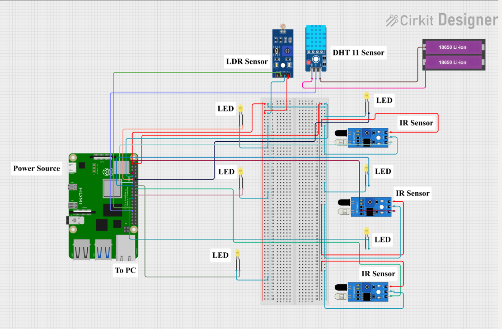
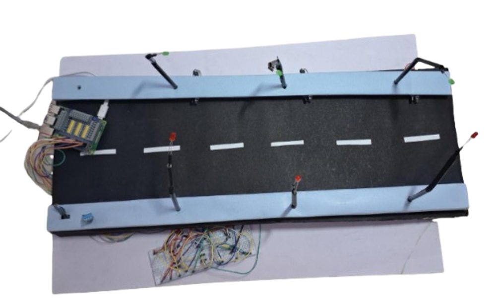

# Smart-City-Simulation

This repository hosts two interconnected projects: a Python/Pygame simulation that visualizes smart city traffic and lighting logic, and a Raspberry Pi hardware setup demonstrating physical streetlight control via LDR and IR sensors.

This repository hosts two distinct, yet conceptually related, projects that explore smart city concepts:
    **Smart City Simulation:** A visual, interactive environment built with Pygame, demonstrating intelligent traffic and street light control.
    **Raspberry Pi Streetlight Controller:** A physical hardware project that uses a Raspberry Pi to control real LEDs based on light levels and object detection.
While the simulation and the hardware controller operate independently, they both showcase principles of intelligent infrastructure, making them a great combined resource for learning and demonstrating IoT and smart systems.
_____________________________________________________________________________________________________________________________________________________________________________

# Project Overview

### 1. Smart City Simulation (Software)  
A dynamic simulation built with **Pygame**, designed to emulate smart city behavior:

- **Real-time Visualization**: Watch cars move, lights respond, and sensors activate.  
- **Smart Traffic Control**: Traffic lights dynamically adjust based on vehicle density at intersections.  
- **Adaptive Streetlights**: Lights react to day/night settings and vehicle proximity.  
- **Interactive GUI**: Add cars, switch day/night mode, and observe system reactions in real time.  
- **Central Broker**: A Python-based server (`broker.py`) acts as a communication hub, handling logic, sensor simulation, and state updates.

### 2. Raspberry Pi Streetlight Controller (Hardware)  
A standalone hardware project that brings smart streetlight control into the physical world:

- **Physical LEDs**: Represent actual streetlights controlled by GPIO.  
- **Ambient Light Detection**: Uses an LDR sensor to distinguish between day and night.  
- **Object Detection**: IR sensors detect nearby vehicles or objects.  
- **Intelligent Logic**: Streetlights only activate in the dark *and* when a nearby object is detected.  
- **Standalone Operation**: The script (`mpca.py`) runs independently on the Pi without external input.
  ______________________________________________________________________________________________________________________________________________________________________________________
# How It Works (Component Breakdown)
   **Smart City Simulation**
   
     broker.py (The Simulation Brain):
      This script launches a TCP socket server. It's the central repository for all simulation data: car positions, sensor states, simulated LDR values, and traffic light states. It processes commands from the          client.py (like moving cars or toggling day/night) and then calculates the appropriate responses for the simulated streetlights and traffic lights based on its internal logic. This data is then sent back to       the client for visualization.
    
    client.py (The Interactive Visualizer):
      This Pygame application connects to broker.py. It fetches the latest simulation state from the broker and renders it graphically. Your interactions (dragging cars, clicking buttons) send commands to the           broker, creating a dynamic feedback loop.
    
    Raspberry Pi Streetlight Controller
      mpca.py (The Hardware Interface): This script is designed specifically for your Raspberry Pi. It directly accesses GPIO pins to read data from your connected LDR and IR sensors. Based on the real-time             inputs from these physical components, it then controls the connected LEDs. The logic here mirrors the streetlight behavior of the simulation: lights activate when it's dark and an object is detected by an        IR sensor.
    
__________________________________________________________________________________________________________________________________________________________________________________________________________________
# Circuit Diagram:
_____________________________________________________________________________________________________________________________________________________________________________

